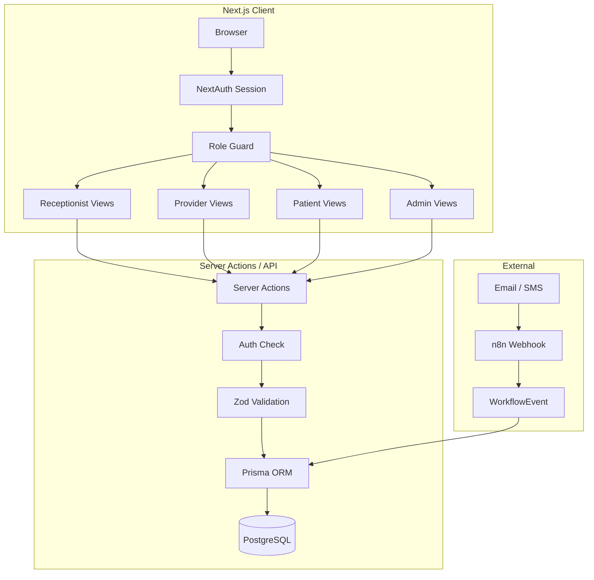
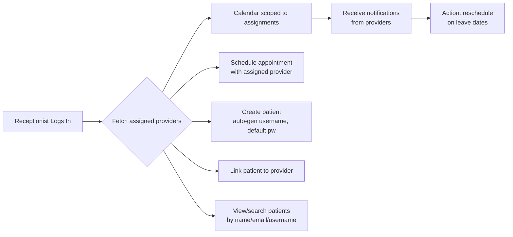
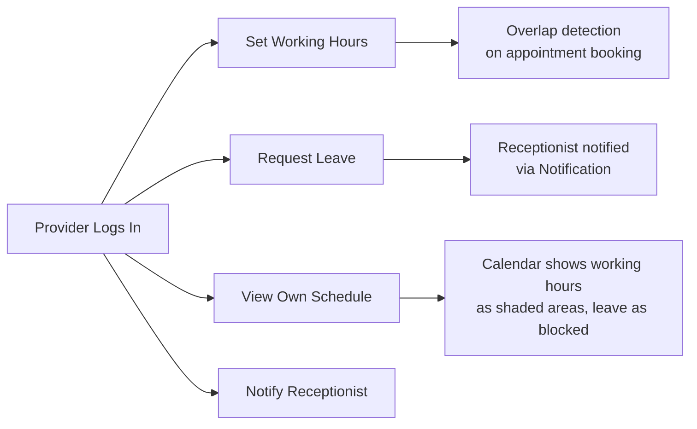
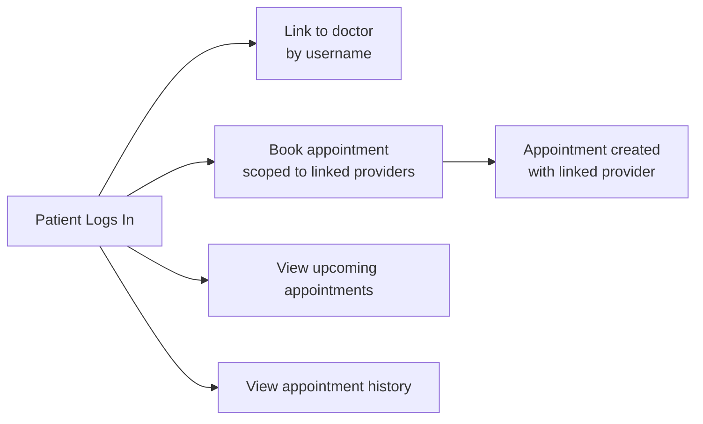
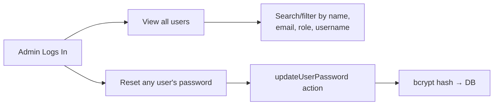
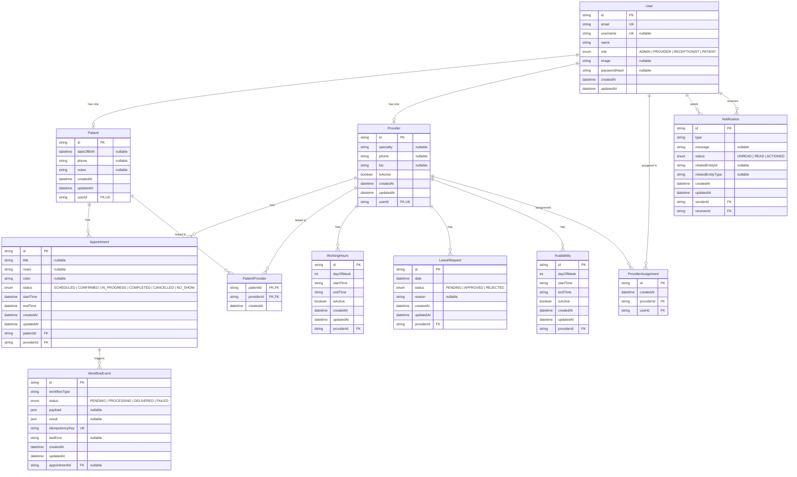

# Architecture & Data Flow

## System Flow

## Role-Based Data Flow

### Receptionist Flow

### Provider (Doctor) Flow

### Patient Flow

### Admin Override Flow

## Entity Relationship Diagram

## Key Relationships

- **User → Patient**: 1:1 (via `userId` unique on Patient)
- **User → Provider**: 1:1 (via `userId` unique on Provider)
- **User → ProviderAssignment**: 1:N (a Provider can be assigned as a receptionist's provider)
- **Patient → Provider**: M:N through `PatientProvider`
- **Provider → WorkingHours**: 1:N (one per day of week)
- **Provider → LeaveRequest**: 1:N
- **Appointment → WorkflowEvent**: 1:N
- **User → Notification**: 1:N (as sender), 1:N (as receiver)

## RBAC Matrix

| Resource          | ADMIN | RECEPTIONIST    | PROVIDER       | PATIENT |
| ----------------- | ----- | --------------- | -------------- | ------- |
| View all users    | ✓     | ✗               | ✗              | ✗       |
| Reset passwords   | ✓     | ✗               | ✗              | ✗       |
| Calendar (scoped) | ✓     | ✓ assigned      | ✓ own          | ✓ own   |
| Appointments      | ✓     | ✓ all           | ✓ own          | ✓ own   |
| Patients          | ✓     | ✓ search/create | ✓ assigned     | ✗       |
| Providers         | ✓     | ✗               | ✗              | ✗       |
| Working Hours     | ✗     | ✗               | ✓ own          | ✗       |
| Leave Requests    | ✗     | ✗               | ✓ own          | ✗       |
| Settings          | ✓     | ✓               | ✓              | ✓       |
| Notifications     | ✗     | ✓ receive       | ✓ send/receive | ✗       |
