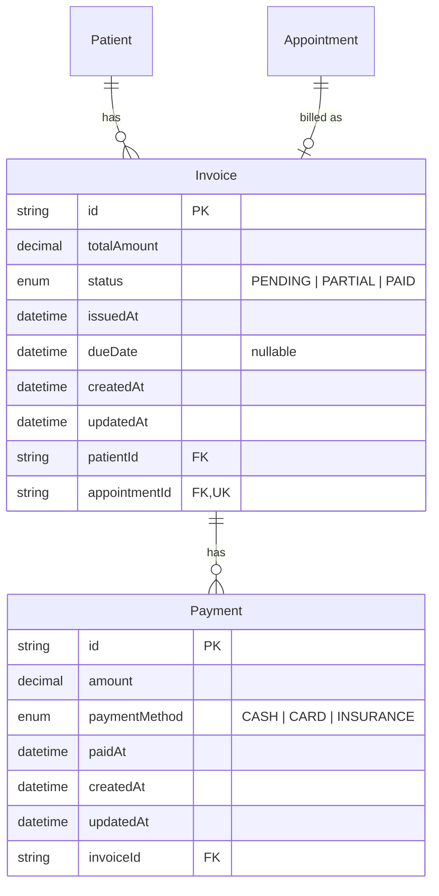

# Phase 3: Billing & Financial Module — Execution Plan

## Objective

Add a complete billing and payment tracking system. Receptionists generate invoices per appointment, record payments (cash/card/insurance), and track payment status (pending/partial/paid). Providers get a financial dashboard showing revenue and outstanding balances.

## UI/UX Execution Table

| #   | Priority | Category         | Page / Component                                           | Role(s)      | What To Build / Change                                                                                                                                                                                             | Server Action(s)                     |
| --- | -------- | ---------------- | ---------------------------------------------------------- | ------------ | ------------------------------------------------------------------------------------------------------------------------------------------------------------------------------------------------------------------ | ------------------------------------ |
| 1   | **P1**   | **Database**     | `prisma/schema.prisma`                                     | ALL          | Add `Invoice` and `Payment` models with enums; link Invoice 1:1 to Appointment, 1:N to Patient; link Payment M:1 to Invoice                                                                                        | —                                    |
| 2   | **P1**   | **Billing**      | `src/server/actions/billing.ts` (new)                      | RECEPTIONIST | `generateInvoiceForAppointment(appointmentId, amount)` — creates Invoice; `addPayment(invoiceId, amount, method)` — creates Payment & auto-updates Invoice status; `getPatientInvoices(patientId)` — list invoices | —                                    |
| 3   | P2       | **Receptionist** | `src/components/billing/generate-invoice-dialog.tsx` (new) | RECEPTIONIST | Open from appointment detail/view; input amount; on submit creates invoice linked to patient; show success with invoice ID                                                                                         | `generateInvoiceForAppointment`      |
| 4   | P2       | **Receptionist** | `src/components/billing/payment-modal.tsx` (new)           | RECEPTIONIST | Open from billing table; select method (CASH/CARD/INSURANCE), input amount; auto-update invoice status to PARTIAL or PAID                                                                                          | `addPayment`                         |
| 5   | P2       | **Receptionist** | `src/app/dashboard/billing/page.tsx` (new)                 | RECEPTIONIST | Invoice list with summary cards (total/collected/outstanding), Record Payment button per row with balance due                                                                                                      | `listInvoices`, `getPatientInvoices` |
| 6   | P2       | **Receptionist** | `src/app/dashboard/billing/invoices/[id]/page.tsx` (new)   | RECEPTIONIST | Invoice detail with payment timeline; add-payment button; show remaining balance                                                                                                                                   | `getInvoiceById`, `addPayment`       |
| 7   | P2       | **Provider**     | `src/app/dashboard/financials/page.tsx` (new)              | PROVIDER     | Revenue summary (total, collected, outstanding) for appointments assigned to this provider; list of invoices scoped to their appointments; date range filter                                                       | `getProviderFinancials`              |
| 8   | P2       | **Patient**      | `/dashboard/billing` (read-only)                           | PATIENT      | Read-only invoice history; show status and payment breakdown                                                                                                                                                       | `getPatientInvoices` (existing)      |
| 9   | P2       | **Calendar**     | `src/components/calendar/booking-modal.tsx`                | RECEPTIONIST | "Generate Invoice" / "View Invoice" button in appointment details view; checks if invoice exists via `getInvoiceByAppointment`                                                                                     | `getInvoiceByAppointment`            |

---

## Table of Contents

1. [Database Schema Expansion](#1-database-schema-expansion)
2. [Billing Server Actions](#2-billing-server-actions)
3. [Receptionist Billing UI](#3-receptionist-billing-ui)
4. [Provider Financial Dashboard](#4-provider-financial-dashboard)
5. [Implementation Order](#5-implementation-order)

---

## 1. Database Schema Expansion

- [x] Add `InvoiceStatus` enum: `PENDING`, `PARTIAL`, `PAID`
- [x] Add `PaymentMethod` enum: `CASH`, `CARD`, `INSURANCE`
- [x] Create `Invoice` model:
  - id, totalAmount (Decimal), status (InvoiceStatus), issuedAt (DateTime), dueDate (DateTime?)
  - patientId FK → Patient (1:N)
  - appointmentId FK → Appointment (1:1, unique)
  - createdAt, updatedAt
- [x] Create `Payment` model:
  - id, amount (Decimal), paymentMethod (PaymentMethod), paidAt (DateTime)
  - invoiceId FK → Invoice (M:1)
  - createdAt, updatedAt
- [x] Run Prisma migration named `add_financial_module`

### 1.1 Financial Data Model Diagram

## 2. Billing Server Actions

- [x] `generateInvoiceForAppointment(appointmentId, amount)` — creates Invoice for an appointment, linked to its patient
- [x] `addPayment(invoiceId, amount, method)` — creates Payment record, auto-updates Invoice status:
  - Sum all payments for invoice
  - If total >= invoice.totalAmount → status = PAID
  - If total > 0 but < invoice.totalAmount → status = PARTIAL
  - If total = 0 → status stays PENDING
- [x] `getPatientInvoices(patientId)` — returns all invoices for a patient with payment summaries

## 3. Receptionist Billing UI

- [x] Create `GenerateInvoiceDialog` component (`src/components/billing/generate-invoice-dialog.tsx`) — opens from appointment detail; input amount; creates invoice
- [x] Create `PaymentModal` component (`src/components/billing/payment-modal.tsx`) — opens from billing table; method + amount; auto-updates invoice status
- [x] Create `/dashboard/billing` page — invoice list with summary cards (total/collected/outstanding); Record Payment button per row with balance due
- [ ] Create `/dashboard/billing/invoices/[id]` detail page — full invoice info with payment timeline, remaining balance, add-payment action

## 4. Provider Financial Dashboard

- [ ] Create `/dashboard/financials` page — revenue summary scoped to provider's appointments
  - Total invoiced, total collected, total outstanding
  - Invoice list with patient name, status, amount, date
  - Date range filter

## 5. Implementation Order

| Priority | Module                      | Depends On | Estimated Files               |
| -------- | --------------------------- | ---------- | ----------------------------- |
| P1       | 1. Database Schema          | —          | 1 (schema) + 1 migration      |
| P1       | 2. Billing Server Actions   | 1          | 1 (action file)               |
| P2       | 3.1 GenerateInvoiceDialog   | 2          | 1 (component)                 |
| P2       | 3.2 PaymentModal            | 2          | 1 (component)                 |
| P2       | 3.3 Billing Page (list)     | 3.1, 3.2   | 1 (page)                      |
| P2       | 3.4 Invoice Detail Page     | 3.1, 3.2   | 1 (page)                      |
| P2       | 3.5 Calendar Integration    | 3.1        | 1 (existing component update) |
| P2       | 4.1 Provider Financial Page | 3.3, 3.4   | 1 (page)                      |

> **Next**: Schema expansion and core server actions first. Then receptionist billing UI. Provider financial dashboard last.
