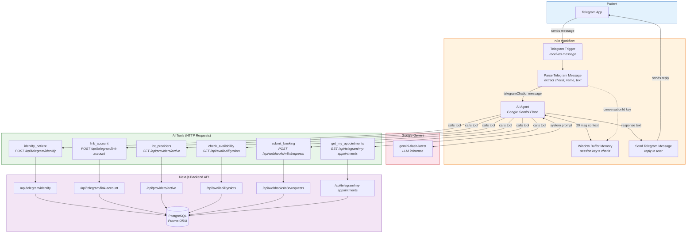
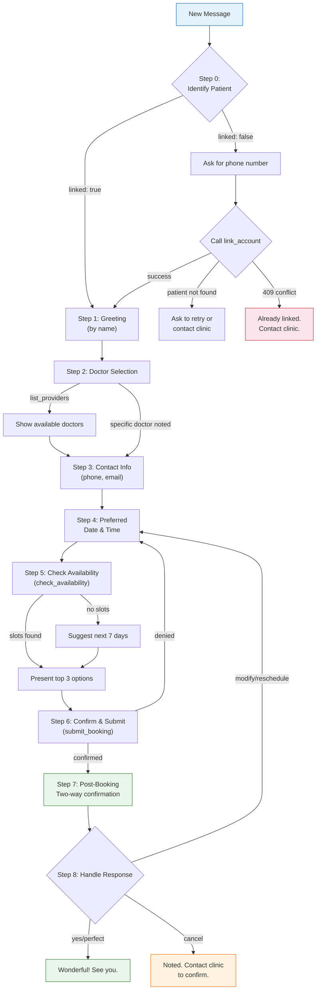

# System Flowchart

## Architecture & Data Flow

---

## How the Flow Works

### 1. Message Reception

The patient sends a message via Telegram. The **Telegram Trigger** node in n8n receives the update and passes it to the **Parse Telegram Message** node, which extracts three fields: `telegramChatId` (unique chat identifier), `patientName` (user's display name), and `message` (the text content).

### 2. AI Processing

The parsed message enters the **AI Agent** node, which communicates with **Google Gemini** (`gemini-flash-latest`) for inference. The AI Agent maintains conversation context through the **Window Buffer Memory** node, which stores the last 20 messages per conversation. The session is keyed by `conversationId` (the Telegram Chat ID), ensuring each user has independent memory.

### 3. Tool Execution

Based on the patient's request, the AI Agent calls one or more of the **6 available tools**. Each tool is an HTTP Request node that calls a specific Next.js API endpoint:

| Tool                  | Endpoint                            | Purpose                                       |
| --------------------- | ----------------------------------- | --------------------------------------------- |
| `identify_patient`    | `POST /api/telegram/identify`       | Check if Telegram user is linked to a patient |
| `link_account`        | `POST /api/telegram/link-account`   | Link Telegram Chat ID to patient via phone    |
| `list_providers`      | `GET /api/providers/active`         | Fetch active doctors                          |
| `check_availability`  | `GET /api/availability/slots`       | Fetch open appointment slots                  |
| `submit_booking`      | `POST /api/webhooks/n8n/requests`   | Submit a booking request                      |
| `get_my_appointments` | `GET /api/telegram/my-appointments` | Get patient's upcoming appointments           |

### 4. Backend Processing

Each API endpoint queries the **PostgreSQL database** via Prisma ORM. The Telegram-specific endpoints (`identify`, `link-account`, `my-appointments`) are public (no auth required) because they are called by the n8n agent, not by user sessions. Data fetching is strictly scoped by `telegramChatId` to prevent cross-patient data leakage.

### 5. Response Delivery

The AI Agent generates a response text, which is passed to the **Send Telegram Message** node. This node sends the reply back to the patient via the Telegram Bot API, completing the conversation loop.

---

## Conversation Flow (AI Decision Tree)

